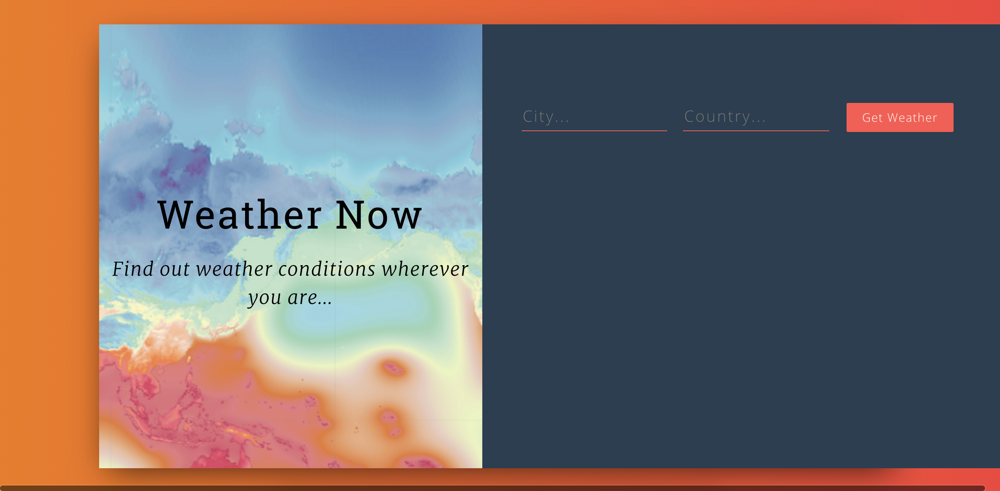
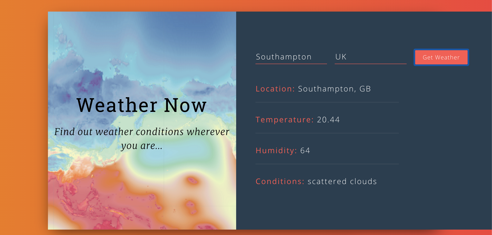

# Weather Now App

I built this app to learn react.js and how to fetch API data with it and decided that starting with something small and simple was the way forward.

## Running the app
### `git clone this repo`
### `cd weather-app-react`
### `npm install`
### `npm start`

Open [http://localhost:3000](http://localhost:3000) to view it in the browser.

### `npm test` 

## How it looks!

